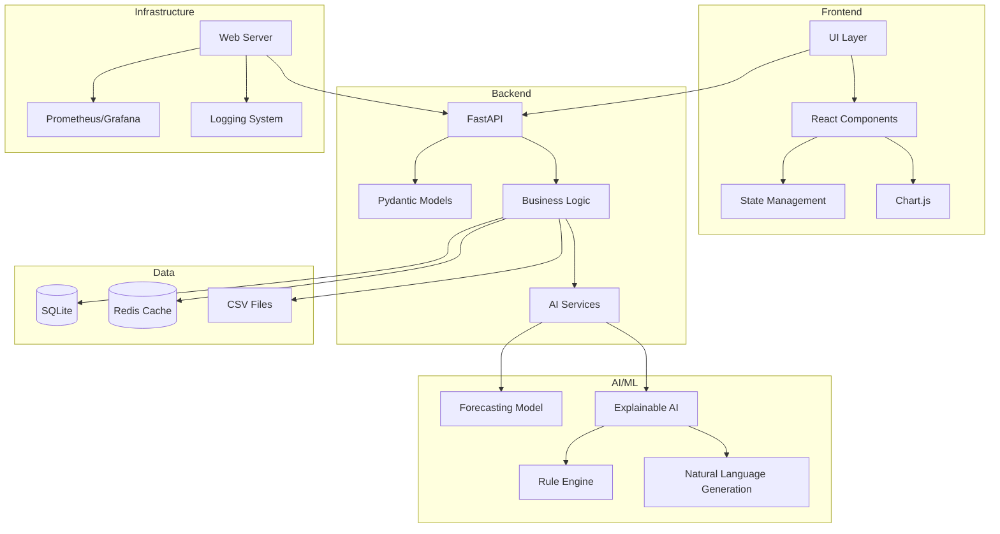
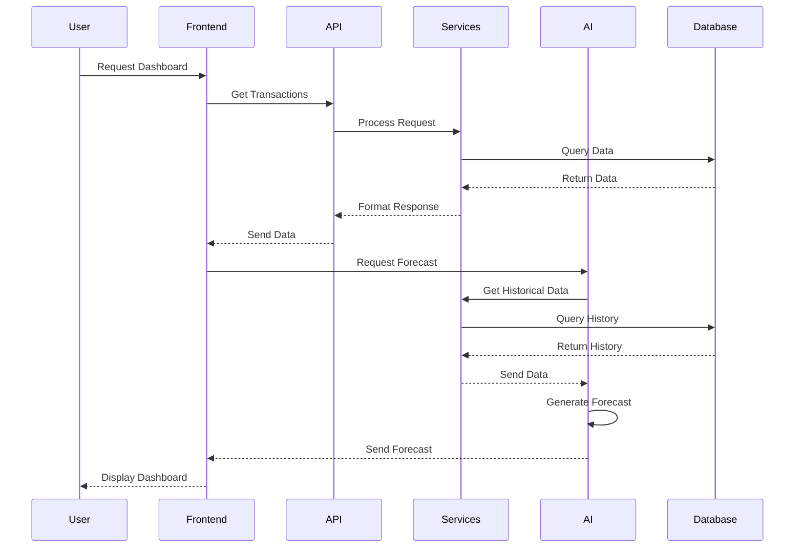
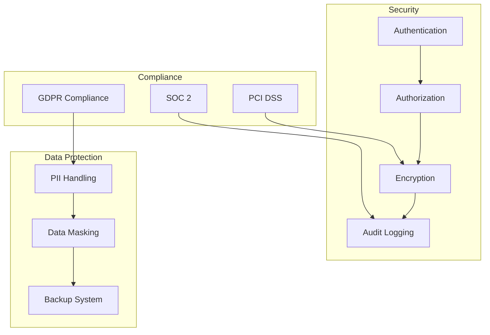
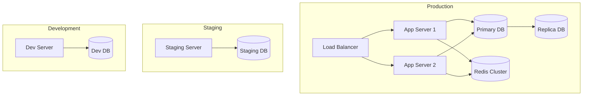

# Technical Architecture

## System Overview

## Component Details

### Frontend Layer
- **UI Layer**: Main application interface
  - Responsive design
  - Progressive loading
  - Error handling
- **React Components**: Reusable UI elements
  - Transaction list
  - Balance cards
  - Forecast charts
  - Insight cards
- **State Management**: Application state
  - React Query for server state
  - Context API for UI state
- **Chart.js**: Data visualization
  - Time series charts
  - Comparison views
  - Interactive elements

### Backend Layer
- **FastAPI**: Main application server
  - RESTful endpoints
  - WebSocket support
  - Async processing
- **Pydantic Models**: Data validation
  - Request/response schemas
  - Data transformation
  - Type checking
- **Business Logic**: Core functionality
  - Transaction processing
  - Balance calculations
  - Data aggregation
- **AI Services**: Machine learning integration
  - Model management
  - Prediction pipeline
  - Explanation generation

### Data Layer
- **SQLite**: Primary database
  - Transaction storage
  - User preferences
  - System configuration
- **Redis Cache**: Performance optimization
  - Forecast results
  - Common queries
  - Session data
- **CSV Files**: Realistic simulated data (generated by advanced simulation script for development and testing)
  - Transaction history
  - Forecast data
  - Insights data

### AI/ML Layer
- **Forecasting Model**: Time series prediction
  - ARIMA/SARIMA
  - Prophet
  - Custom models
- **Explainable AI**: Insight generation
  - Pattern detection
  - Anomaly detection
  - Trend analysis
- **Rule Engine**: Business logic
  - Financial rules
  - Recommendation rules
  - Validation rules
- **Natural Language Generation**: Human-readable insights
  - Template-based generation
  - Context-aware formatting
  - Multi-language support

### Infrastructure Layer
- **Web Server**: Application hosting
  - Nginx
  - Gunicorn
  - SSL/TLS
- **Monitoring**: System observability
  - Performance metrics
  - Error tracking
  - Usage analytics
- **Logging**: System logs
  - Application logs
  - Error logs
  - Audit logs

## Data Flow

## Security Architecture

## Deployment Architecture

